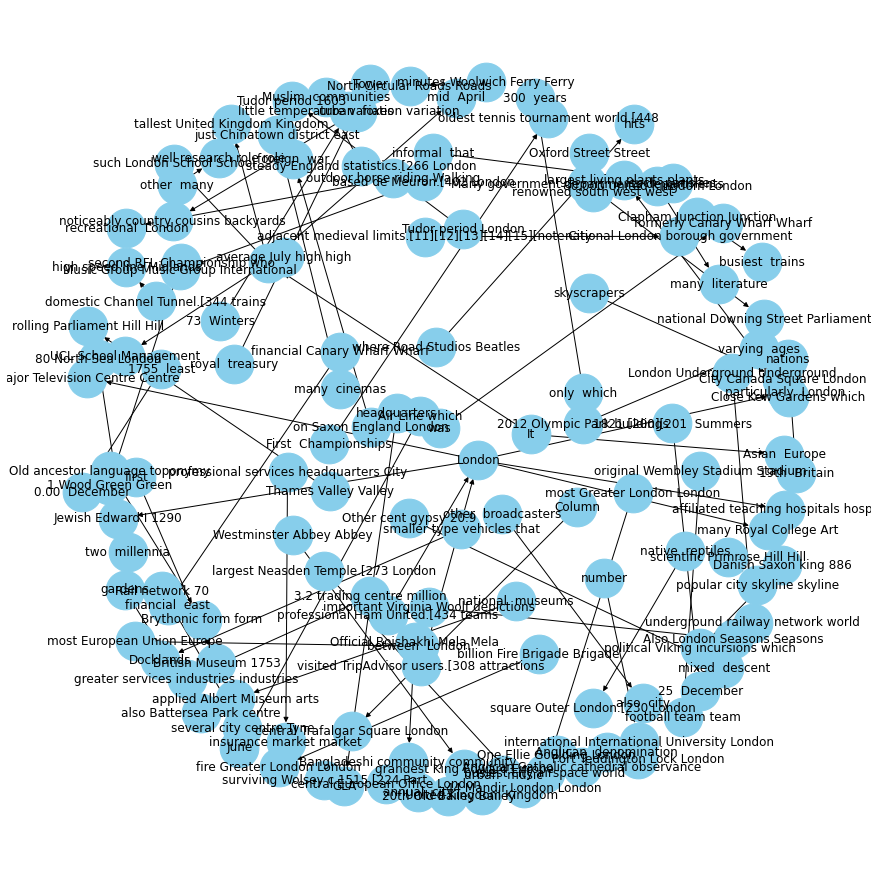

# knowledge-graph

## Let's parse HTML, make Knowledge Graph triple data and plot it.

Scrap and parse text data from a webpage and make triple Knowledge Graph data.

Triples are saved as a cvs file in `data/` and a graph is generated.

* To run:
* Install python3.7 and the required packages
```
conda create -n k-g python=3.7 pip
python -m pip install -r requirements.txt
```
```
python knowledge_graph.py (optional argument)
```


```
(optional arguments):
  -h, --help            show a help message and exit
  -f, --from-file       Give a file path and draw a Knowledge Graph plot from the file.
      --no-graph        Do not draw a graph.
      --no-save         Do not save a triple data as a file.
  -u, --url             Provide an URL containing text to parse.
  -s, --source           Draw a Knowledge Graph only for the given source words.
  -t, --target          Draw a Knowledge Graph only for the given target words.
  -e, --edge            Draw a Knowledge Graph only for the given edge words.
  -f, --with-file       Provide a recording file rather than record

  (source, target, edge arguments can take multiple words.)
```


- A graph example for [London Wikipedia](https://en.wikipedia.org/wiki/London) page where edges are one of `["is","was","are","were","been"]`:

